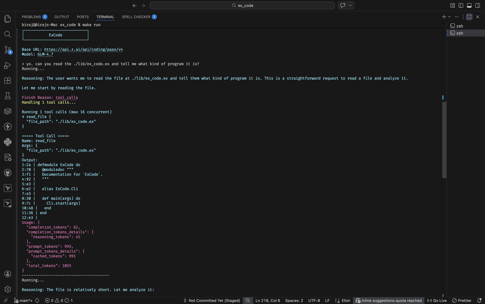

# ExCode

An AI coding assistant that lives in your terminal. Give it prompts and it reads files, edits code, and runs commands—just like you'd do, but with an AI at the wheel. Written in Elixir.



## What it does

ExCode is a REPL that connects to OpenAI-compatible APIs (OpenAI, Cerebras, etc.). It has tools for:

- **Reading files** - With line numbers and hashes for safe editing
- **Writing files** - Creating new files or overwriting existing ones
- **Editing specific lines** - Edit a range of lines with hash verification
- **Running commands** - Execute bash commands (with your approval first)

The AI decides which tools to use based on what you ask.

## Quick start

### Requirements

- Elixir 1.19+
- An API key for OpenAI or a compatible service

```bash
# Install dependencies
mix deps.get

# Set up .env
cp .env.example .env
# Edit .env with your API key, base URL, and model

# Run it
make run
```

Or build an escript:

```bash
make build
# or
mix escript.build
```

Then run the executable:

```bash
./excode
```

## Configuration

Create a `.env` file:

```env
OPENAI_API_KEY=your_key_here
OPENAI_BASE_URL=https://api.openai.com/v1
OPENAI_MODEL=gpt-4o
```

For Cerebras:

```env
OPENAI_API_KEY=your_cerebras_key
OPENAI_BASE_URL=https://api.cerebras.ai/v1
OPENAI_MODEL=llama3.1-70b
```

## Using it

Once running, you get a `>` prompt. Type what you need:

```
> read all the files in ./lib/ and summarize the architecture
> create a new module for handling user input
> run the tests
```

### REPL commands

- `/exit` or `/quit` - Quit
- `/ctx` - Show the conversation history

## How it works

The AI has access to tools via function calling. When you ask it to do something, it:

1. Reads the relevant files
2. Figures out what needs to happen
3. Calls the right tools (read, write, edit, run command)
4. Loops until the task is done

### Available Tools

ExCode can use the following tools (via AI function calling):

| Tool               | Description                                                 |
| ------------------ | ----------------------------------------------------------- |
| `read_file`        | Read and display file contents with line numbers and hashes |
| `write_file`       | Write content to a file                                     |
| `run_bash_command` | Execute shell commands (requires user confirmation)         |
| `edit_file`        | Edit a specific range of lines in a file                    |

It's configured to be careful—it asks before running commands, avoids reading sensitive files (.env, keys, etc.), and verifies file edits with hashes.

## Architecture

- `cli.ex` - Entry point, prints the banner
- `repl.ex` - Main REPL loop, handles `/exit`, `/ctx`
- `execute.ex` - Calls the OpenAI API, processes responses
- `tools.ex` - Tool implementations (read, write, edit, run)
- `context.ex` - Keeps track of the conversation
- `env.ex` - Reads config from Application env
- `term_ui.ex` - Color helpers for terminal output
- `system_prompt.ex` - The system prompt that defines the AI's behavior

## License

MIT

---

_This README was written by ExCode—the very AI assistant it describes._
